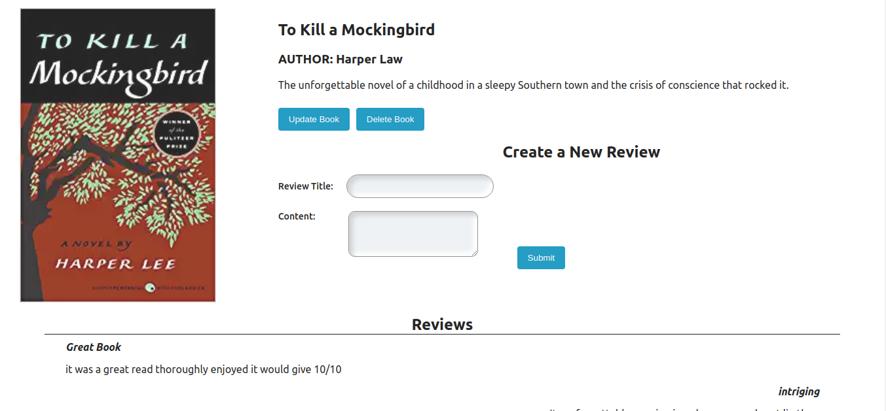

# Books-Review
-----

- This is the CLIENT frontend for the books-review project .The Back-end can be found at: [Back-End](https://github.com/Book-Bros/phase-4-books-api)
    <br/>


## Technologies-used
              
       
   
   
   
## Description
-  The actions that the user can make are:
1. Users register / login to the platform
2. A user creates a book and reviews that are well described.
3. A user can then update books and their reviews.
4. A user can then delete books and their reviews.
5. In order to use the application, the user must be logged in.


## Screen-shots
### Books page

    <br />

### Single Book page


## Prerequisites
- To start this project one must have the following:
    1. **Text-editor** (**VSCode** is :sunglasses:)
    2. **React** 
    3. **Patience**

## Livelink
Use netlify  to check out website and perform operations from there.The link in the About section


## Installation
1. Clone this repository
    ```bash
        git clone https://github.com/Book-Bros/phase-4-books-client.git
    ```

2. Go into the project directory

    ```bash
        cd phase-4-books-api
    ```

3. Install the necessary dependencies by bundling
    ```bash
        npm install
    ```

4. Start up the website
    ```bash
         npm start
    ```


## Contributers
 

1. [Stephen-Nene](https://github.com/Stephen-nene)
2. [Sammy-CK](https://github.com/Sammy-CK)
3. [Samueelx](https://github.com/Samueelx)
4. [ShuaibShaban](https://github.com/ShuaibShaban)


## license
- [MIT License](./LICENSE.md)
### **Copyright**
   - Book-Bros (c) 2023
