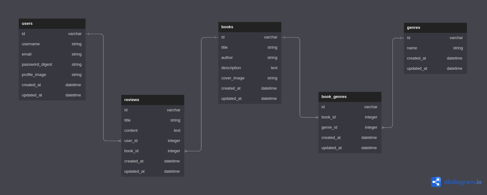

# Books-Review
-----

- This is the API backend for the books-review project .The Front-End can be found at [Front-End](https://github.com/Book-Bros/phase-4-books-client)<br/>


## Technologies-used
              
       
   
   
## Description
- This backend allows the the react front-end to access the following endpoints in a **RESTful** mode:
  ```
    - Users Login/Sign-up
    - Users_checklogin
    - Genre/genres
    - Book/books
    - Review/review
    ```

- The actions that the user can make are:
    ```
    - Create a user account and add a profile to it.
    - Login to a his account.
    - He/she can create a new book and assing it to a specific genre.
    - He/she can review the books of other users in the app.
    ```


## Database
- Below is a sample diagram of the database tables we used.

- The database below contains the following tables including `books`, `genres`, `book_genres`, `users`, and `reviews`.




- The ``books`` table contains information about `books`, including a title, author, description, and cover image.
- The `genres` table contains a list of possible `genres` for `books`. The `book_genres` table is a join table that associates `books` with `genres` through their ids.
- The `users` table contains information about `users`, including their username, email, password digest, and profile image.
- Finally, the `reviews` table is a table that stores information about `reviews` written by `users` for `books` they have read, including a title, content, user id, and book id.

## Prerequisites
- To start this project one must have the following:
    1. **Sqlite3**
    2. **Text-editor** (**VSCode** is :sunglasses:)
    3. **ruby** >=2.5
    4. **Rails**
    4. **Patience**

## Installation
1. Clone this repository
    ```bash
        git clone https://github.com/Book-Bros/phase-4-books-api.git
    ```

2. Go into the project directory

    ```bash
        cd phase-4-books-api
    ```

3. Install the necessary dependencies by bundling
    ```bash
        bundle install
        bundle update
    ```

4. set-up the database
    ```bash
        rails db:migrate
        rails db:seed
    ```
5. Start up the server
    ```bash
        rails s
    ```


## Endpoints
### genres
        resources :genres, only: [:index]

### books
         resources :books


### user
        post '/users', to: 'users#create'
        post '/users/login', to: 'users#login'
        get '/users/logout', to: 'users#logout'
        get '/users/checklogin', to: 'users#check_logged_in'
        post '/users/update-password', to: 'users#update_password'

  ### Reviews
        post '/books/:book_id/reviews', to: "reviews#create"
        get '/books/:book_id/reviews/:id', to: "reviews#show"
        get '/books/:book_id/reviews', to: "reviews#index"
        delete '/books/:book_id/reviews/:id', to: "reviews#destroy"
        put '/books/:book_id/reviews/:id', to: "reviews#update"

## Contributers
 

1. [Stephen-Nene](https://github.com/Stephen-nene)
2. [Sammy-CK](https://github.com/Sammy-CK)
3. [Samueelx](https://github.com/Samueelx)
4. [ShuaibShaban](https://github.com/ShuaibShaban)


## license
- [MIT License](./LICENSE.md)
### **Copyright**
   - Book-Bros (c) 2023